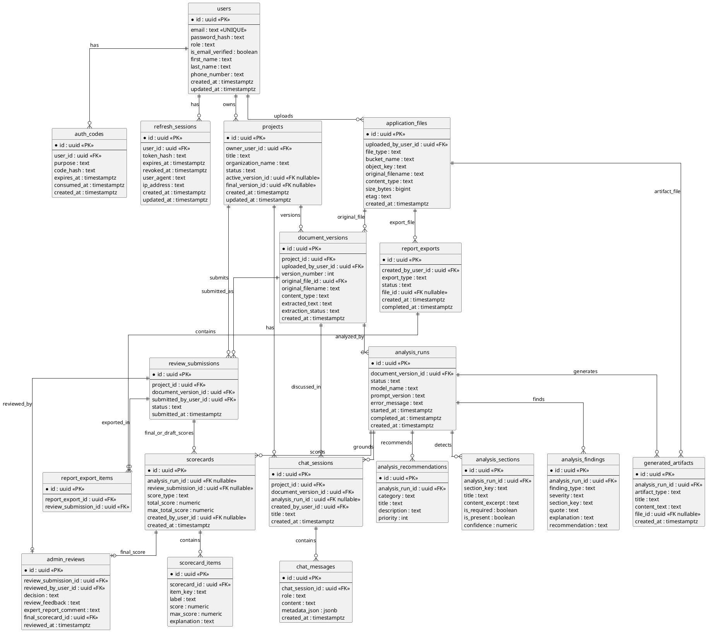
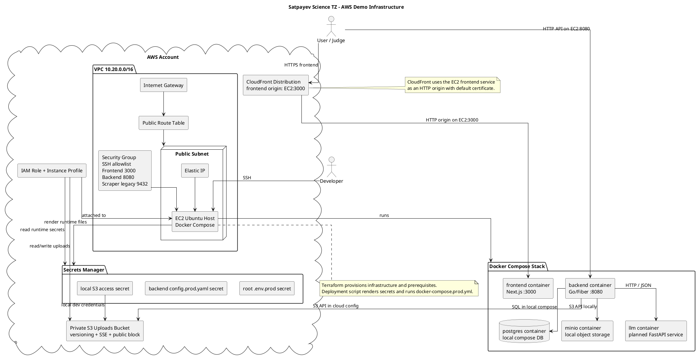

# Architecture

Satpayev Science TZ is an AI-assisted system for analyzing and improving technical specifications for scientific projects.

The architecture follows one main rule:

**Core Backend owns workflow and data. AI Service owns intelligence. Frontend talks only to Core Backend.**

## C4 Container Diagram

```plantuml
@startuml
!include https://raw.githubusercontent.com/plantuml-stdlib/C4-PlantUML/master/C4_Container.puml

LAYOUT_WITH_LEGEND()

title Satpayev Science TZ - C4 Container Diagram

Person(client, "Client / Researcher", "Uploads scientific TZ documents, reviews AI analysis, improves drafts, chats with assistant, submits final version")
Person(admin, "Admin / Expert", "Reviews submitted projects, edits final evaluation scorecard, writes feedback, exports approved projects")

System_Boundary(system, "Satpayev Science TZ") {
  Container(frontend, "Frontend", "Next.js / React", "Client and Admin UI for upload, analysis, chat, review, and report download")

  Container(backend, "Core Backend", "Go / Fiber", "System of record: auth, projects, document versions, analysis persistence, scoring, chat, reviews, reports")

  Container(ai, "AI Service", "Python / FastAPI", "Stateless intelligence engine for document analysis, score drafting, recommendations, rewrites, and chat responses")

  ContainerDb(postgres, "PostgreSQL", "PostgreSQL", "Users, projects, document versions, analysis runs, scorecards, chat, reviews, report exports")

  Container(storage, "Object Storage", "MinIO locally / AWS S3 in cloud", "Original uploaded documents and generated report artifacts")

  Container(reporting, "Report Generator", "Backend module", "Builds downloadable reports and XLSX exports from persisted backend data")
}

System_Ext(llm_provider, "External LLM Provider", "Optional OpenAI/Groq-compatible API used by AI Service when API keys are configured")
System_Ext(email, "SMTP Provider", "Optional production email delivery for auth verification")

Rel(client, frontend, "Uses", "HTTPS")
Rel(admin, frontend, "Uses", "HTTPS")

Rel(frontend, backend, "Calls REST API", "HTTPS / JSON")

Rel(backend, postgres, "Reads/writes business data", "SQL")
Rel(backend, storage, "Stores and retrieves uploaded files and generated reports", "S3 API")
Rel(backend, ai, "Requests analysis and chat responses", "HTTP / JSON")
Rel(backend, reporting, "Invokes report generation", "In-process call")
Rel(backend, email, "Sends auth emails in production", "SMTP")

Rel(ai, llm_provider, "Generates analysis/recommendations/chat when enabled", "HTTPS")

Rel(reporting, postgres, "Reads approved review and scorecard data", "SQL")
Rel(reporting, storage, "Writes report artifacts", "S3 API")

note right of backend
Backend is the only system of record.
AI Service has no direct Core Postgres access.
Frontend never talks directly to AI Service or object storage.
end note

note bottom of ai
AI Service must support heuristic fallback
for demos without external LLM keys.
end note

@enduml
```

## Core Data Model ERD



## Scoring Model

The system stores three scorecard types.

### AI Document Analysis Scorecard

Diagnostic score shown to Client and Admin:

- `structure`: `0..100`
- `completeness`: `0..100`
- `clarity`: `0..100`
- `kpi_results`: `0..100`
- `consistency`: `0..100`

The total is the rounded average unless a future document explicitly defines weights.

### AI Preliminary Evaluation Scorecard

AI draft score using the official Excel rubric:

- `strategic_relevance`: `0..20`
- `goals_and_tasks`: `0..10`
- `scientific_novelty`: `0..15`
- `practical_applicability`: `0..20`
- `expected_results`: `0..15`
- `socio_economic_effect`: `0..10`
- `feasibility`: `0..10`

The total is the sum and must be `0..100`.

### Final Reviewed Evaluation Scorecard

Admin/expert score using the same official Excel rubric. The Admin edits categories; the backend computes the total.

This scorecard is used for official approved XLSX export.

## Chat Architecture

Chat is document-aware and project-bound.

For each chat request, Core Backend loads:

- project metadata;
- active document version;
- extracted text snapshot;
- latest completed analysis;
- AI document analysis scorecard;
- AI preliminary evaluation scorecard;
- findings and recommendations;
- prior chat messages;
- optional latest admin feedback.

The Backend sends this compact context to AI Service. AI Service returns an assistant answer. Backend persists both user and assistant messages.

Chat can propose rewrites and explain scores, but it must not modify the stored document version. A rewrite becomes official only through a separate upload/version action.

## IaC Cloud Architecture Diagram

The current cloud architecture is an EC2 + Docker Compose demo platform managed by Terraform.



## Deployment Notes

Local development currently uses:

- root `docker-compose.yml`;
- PostgreSQL container;
- MinIO container;
- Go backend container;
- Next.js frontend container.

AWS demo deployment currently uses:

- Terraform under `infrastructure/terraform/envs/dev`;
- one public EC2 instance;
- Docker Compose from `docker-compose.prod.yml`;
- AWS Secrets Manager runtime files;
- AWS S3 uploads bucket;
- CloudFront for frontend access.

The AI service container is planned and should be added only after the backend AI client and Python service are implemented.
