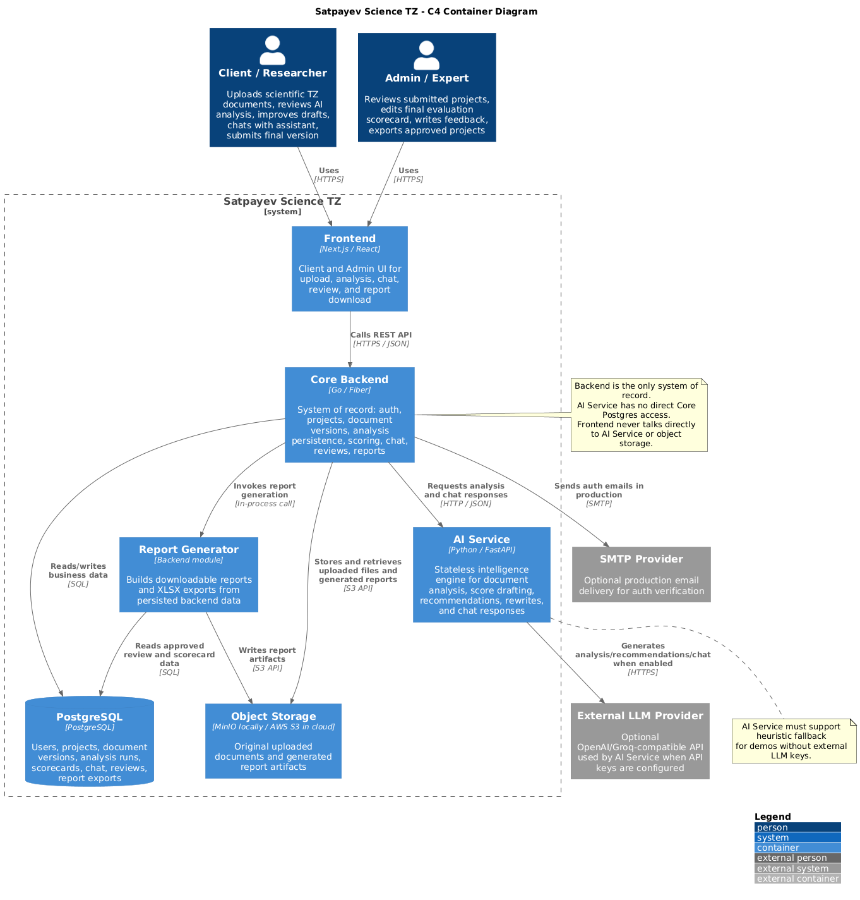
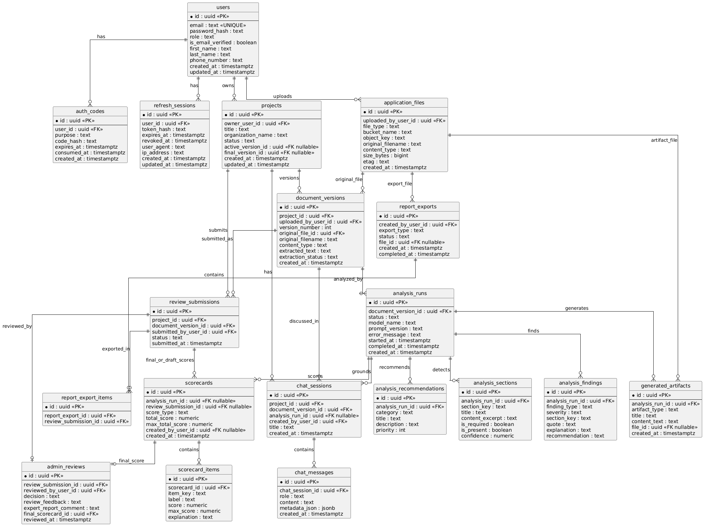
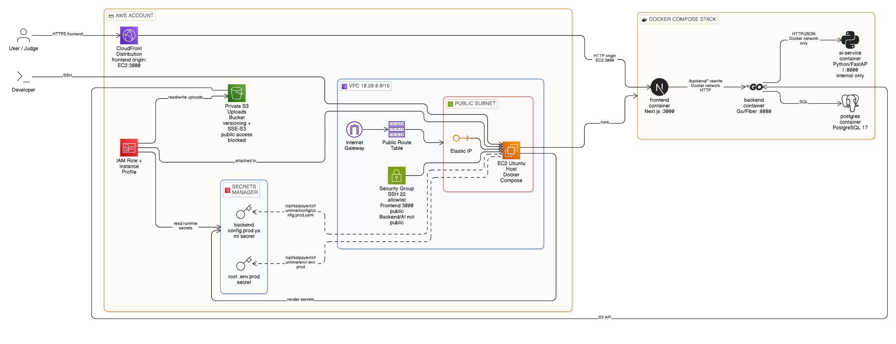

# Satpayev Science TZ (AI System For Analyzing and Improving Technical Specifications for Scientific Projects)

- [] описание

---

ToDo:

- [] исправить NLP результат и корректировка в /ai-service or /backend, он выдает ошибочную рекомендацию на /frontend
- [] чат на стороне /frontend не работает

---

## Содержание

- [Satpayev Science TZ (AI System For Analyzing and Improving Technical Specifications for Scientific Projects)](#satpayev-science-tz-ai-system-for-analyzing-and-improving-technical-specifications-for-scientific-projects)
  - [Содержание](#содержание)
  - [Документы Хакатона](#документы-хакатона)
  - [Архитектура](#архитектура)
    - [C4 Container Diagram](#c4-container-diagram)
    - [ERD (Entity Relationship Diagram) (Backend/PostgreSQL)](#erd-entity-relationship-diagram-backendpostgresql)
    - [IaC Cloud Architecture Diagram (Infrastructure as Code) (Terraform, AWS)](#iac-cloud-architecture-diagram-infrastructure-as-code-terraform-aws)
  - [Сервисы монорепозитория](#сервисы-монорепозитория)
  - [Quickstart](#quickstart)
    - [Локальный запуск](#локальный-запуск)
    - [Быстрый AWS деплой](#быстрый-aws-деплой)

---

## Документы Хакатона

- Техническое Задание Хакатона (RUS): [/docs/ТЗ_официальное.docx](/docs/ТЗ_официальное.docx)
- Шаблон Научного ТЗ для обработки: [/docs/Шаблон_для_ТЗ_рус.docx](/docs/Шаблон_для_ТЗ_рус.docx)
- Пример Научного ТЗ для обработки: [/docs/TZ_digital_polegon.docx](/docs/TZ_digital_polegon.docx)
- Шаблон Итоговая Таблица Оценки Научных ТЗ: [/docs/Оценка_ТЗ_шаблон.xlsx](/docs/Оценка_ТЗ_шаблон.xlsx)

---

## Архитектура

Подробности: [ARCHITECTURE.md](ARCHITECTURE.md)

### C4 Container Diagram



### ERD (Entity Relationship Diagram) (Backend/PostgreSQL)



---

### IaC Cloud Architecture Diagram (Infrastructure as Code) (Terraform, AWS)



---

## Сервисы монорепозитория

| Модуль | Назначение | Технологии |
|---|---|---|
| `frontend/` |  | Next.js, React |
| `backend/` |  | Go, PostgreSQL |
| `ai-service/` | AI/NLP анализ и генерация улучшений ТЗ | Python, FastAPI |
| `infrastructure/` | IaC и облачная инфраструктура | Terraform, AWS, DevOps stack |

Namings:

- Satpayev_science_tz_hackaton
- Satpayev Science TZ
- satpayev-sciencetz
- satpayev-tz

---

## Quickstart

### Локальный запуск

1. Заполните корневой `.env` по примеру `.env.example`.
2. Также заполните `backend/config/config.local.yaml` по примеру `backend/config/config.example.yaml` и вашего `.env`.
3. Поднимите стек:

```bash
docker compose up -d --build
```

### Быстрый AWS деплой

**Подробная информация здесь:** [`infrastructure/README.md`](infrastructure/README.md)

1. Перейдите в [`infrastructure/`](infrastructure/README.md) и создайте `terraform.tfvars` из `infrastructure/terraform/envs/dev/terraform.tfvars.example`.
2. Примените Terraform из `infrastructure/terraform/envs/dev`.
3. Запишите в AWS Secrets Manager два секрета:
   - содержимое корневого `.env.prod`
   - содержимое `backend/config/config.prod.yaml`
4. На EC2-контейнерном хосте клонируйте репозиторий и запустите:

```bash
export AWS_REGION="your-region"
export COMPOSE_ENV_SECRET_NAME="satpayevtz/dev/.env.prod"
export BACKEND_CONFIG_SECRET_NAME="satpayevtz/dev/backend/config.prod.yaml"
./infrastructure/scripts/deploy_compose.sh
```

5. Заберите `frontend_cloudfront_url` из Terraform outputs. Это и будет generic CloudFront URL для фронтенда.
