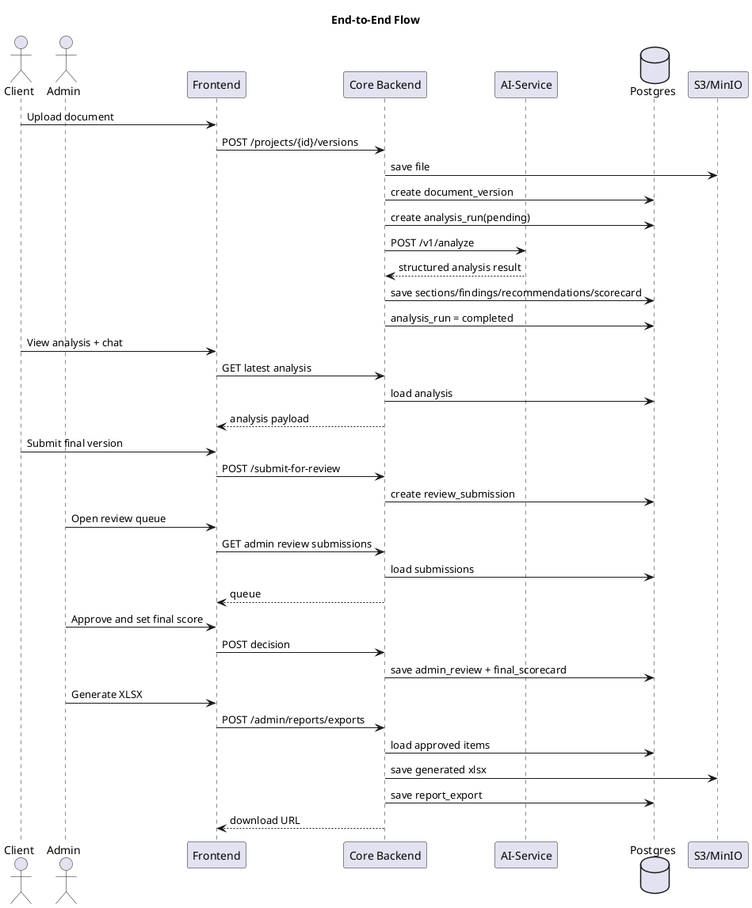

# draft final technical specification and architecture

BASED ON: [docs/spikes/ChatGPT-Разбор-Технического-Задания.md](docs/spikes/ChatGPT-Разбор-Технического-Задания.md)

---

Ниже — уже **цельная инженерная спецификация** под вашу утверждённую бизнес-логику.

Я исхожу из уже принятых вами решений:

* **Core Backend (Go)** — единственный владелец бизнес-данных и единственный сервис, который работает с основной Postgres БД.
* **AI-Service (Python/FastAPI)** — stateless intelligence engine, без прямого доступа к core Postgres.
* **Frontend** ходит только в Core Backend.
* **Client** видит preliminary AI score по той же rubric, что потом идёт в финальный review/XLSX.
* **Admin** подтверждает или корректирует score, оставляет `review_feedback` и `expert_report_comment`, после чего approved проекты идут в финальный XLSX export.
* Система обязана поддерживать загрузку PDF/Word/TXT, анализ структуры, проверку обязательных разделов, AI-анализ текста, score 0–100, рекомендации, улучшенную версию, итоговый отчёт, чат и историю документов. 
* Шаблон научного ТЗ задаёт важные ожидаемые элементы: цель, задачи, стратегические документы, прямые результаты, количественные показатели, конечный результат, socio-economic effect и целевых потребителей результатов. 

---

# 1. Final Architecture Contract

## 1.1. System of Record

**Core Backend + Postgres** — это единственный источник истины для:

* users
* roles
* projects
* document versions
* analysis results
* scorecards
* chat sessions/messages
* review workflow
* report exports

## 1.2. AI Boundary

**AI-Service**:

* не читает и не пишет core DB;
* не знает бизнес-правил ownership;
* не знает auth/session logic;
* получает только входной payload;
* возвращает только structured AI result.

## 1.3. Score Model

Одна official score rubric для Client и Admin:

* strategic_relevance: 0..20
* goals_and_tasks: 0..10
* scientific_novelty: 0..15
* practical_applicability: 0..20
* expected_results: 0..15
* socio_economic_effect: 0..10
* feasibility: 0..10

`total_score = sum(all category scores)` => `0..100`

### Two states

* `ai_preliminary_scorecard`
* `final_reviewed_scorecard`

`final_reviewed_total_score` **не суммируется** с preliminary; он становится финальным официальным total.

---

# 2. Core Backend Golang

## 2.1. Responsibilities of Core Backend

Core Backend обязан:

* аутентифицировать и авторизовывать пользователей;
* хранить пользователей, роли, проекты и версии документов;
* сохранять файлы в S3/MinIO;
* запускать analysis lifecycle;
* сохранять structured AI outputs в DB;
* отдавать фронту analysis result;
* хранить и отдавать историю версий;
* управлять chat sessions/messages;
* собирать chat context для AI-Service;
* управлять review queue;
* принимать admin review decision;
* хранить final reviewed scorecard;
* генерировать XLSX exports;
* обеспечивать auditability.

---

## 2.2. Suggested Backend Structure

```txt id="g0mods"
backend/
  cmd/
    api/
      main.go

  internal/
    auth/
    users/
    organizations/
    projects/
    documents/
    storage/
    analysis/
    scorecards/
    recommendations/
    chat/
    reviews/
    reports/
    ai/
    common/

  platforms/
    http/
      server/
      middleware/
      handlers/
      dto/
      presenters/
      clients/
        ai/
      streaming/

  migrations/
  seeds/
```

---

## 2.3. `backend/internal/[modules]`

## `auth/`

Responsibilities:

* register
* login
* refresh
* logout
* password hashing
* JWT/session validation
* role extraction

Key entities:

* credentials
* access tokens
* refresh tokens

---

## `users/`

Responsibilities:

* user profile
* role view
* user preferences
* profile updates

---

## `organizations/`

Responsibilities:

* organization records
* organization metadata
* mapping user to organization
* optional admin filtering by organization

---

## `projects/`

Responsibilities:

* create/update/list/get project
* enforce ownership
* maintain project status
* select active version
* submit final version for review

---

## `documents/`

Responsibilities:

* upload version
* store document metadata
* store extracted text snapshot
* maintain version order
* mark selected final version

---

## `storage/`

Responsibilities:

* save original file
* generate presigned download URL if needed
* fetch file bytes for report generation
* delete/replace file when required

---

## `analysis/`

Responsibilities:

* create analysis_run
* call AI-Service
* persist findings
* persist scorecard
* persist recommendations
* persist generated artifacts
* mark status: pending/running/completed/failed

---

## `scorecards/`

Responsibilities:

* store preliminary scorecard
* store final reviewed scorecard
* compute total from category scores
* validate category max values

---

## `recommendations/`

Responsibilities:

* expose AI-generated recommendations
* expose improved text snippets
* expose suggested structure/example artifacts

---

## `chat/`

Responsibilities:

* create session
* append message
* fetch conversation
* assemble AI context
* call AI-Service for answer
* save assistant answer

---

## `reviews/`

Responsibilities:

* create review submission
* admin queue
* review detail
* save decision: approved / rejected / needs_revision
* save `review_feedback`
* save `expert_report_comment`
* save final reviewed scorecard

---

## `reports/`

Responsibilities:

* export single approved project to XLSX
* export multiple approved projects to XLSX
* load workbook template
* map review data into workbook row(s)
* save export artifact
* return download info

---

## `ai/`

Responsibilities:

* AI client interface
* payload builders
* response validation
* timeout/retry policy
* correlation IDs
* mapping AI DTOs to domain objects

---

## `common/`

Responsibilities:

* shared types
* errors
* enums
* pagination
* validation helpers
* tracing/logging helpers

---

# 3. Core Backend ERD — PlantUML

Ниже схема таблиц под выбранную вами архитектуру: **всё хранится в core DB, AI-service в БД не ходит**.

```plantuml id="erd001"
@startuml
title Core Backend ERD
hide methods
hide stereotypes
skinparam linetype ortho

entity users {
  *id : uuid
  --
  email : varchar(255) <<unique>>
  password_hash : varchar(255)
  full_name : varchar(255)
  role : varchar(32)  // client | admin
  organization_id : uuid <<nullable>>
  is_active : boolean
  created_at : timestamptz
  updated_at : timestamptz
}

entity organizations {
  *id : uuid
  --
  name : varchar(255)
  created_at : timestamptz
  updated_at : timestamptz
}

entity projects {
  *id : uuid
  --
  owner_user_id : uuid
  organization_id : uuid <<nullable>>
  title : varchar(500)
  short_description : text <<nullable>>
  status : varchar(32) // draft | in_progress | submitted_for_review | under_review | approved | rejected | needs_revision
  active_version_id : uuid <<nullable>>
  created_at : timestamptz
  updated_at : timestamptz
}

entity document_versions {
  *id : uuid
  --
  project_id : uuid
  version_number : int
  source_type : varchar(32) // upload | ai_generated | revised
  original_filename : varchar(500)
  mime_type : varchar(128)
  storage_key : varchar(500)
  file_size_bytes : bigint
  extracted_text : text <<nullable>>
  status : varchar(32) // uploaded | analyzed | improved | selected_as_final
  created_by_user_id : uuid
  created_at : timestamptz
}

entity analysis_runs {
  *id : uuid
  --
  project_id : uuid
  document_version_id : uuid
  status : varchar(32) // pending | running | completed | failed
  request_payload_hash : varchar(128)
  ai_model_name : varchar(128) <<nullable>>
  ai_model_version : varchar(128) <<nullable>>
  prompt_bundle_version : varchar(128) <<nullable>>
  started_at : timestamptz <<nullable>>
  completed_at : timestamptz <<nullable>>
  error_message : text <<nullable>>
  created_at : timestamptz
}

entity analysis_sections {
  *id : uuid
  --
  analysis_run_id : uuid
  section_key : varchar(128)
  section_title : varchar(255)
  section_order : int
  detected : boolean
  confidence : numeric(5,4) <<nullable>>
  source_excerpt : text <<nullable>>
}

entity analysis_findings {
  *id : uuid
  --
  analysis_run_id : uuid
  finding_type : varchar(64) // missing_section | vague_statement | inconsistency | missing_kpi | missing_expected_result | logic_issue
  severity : varchar(16) // low | medium | high
  criterion_key : varchar(64) <<nullable>>
  section_key : varchar(128) <<nullable>>
  title : varchar(255)
  explanation : text
  source_excerpt : text <<nullable>>
  created_at : timestamptz
}

entity recommendations {
  *id : uuid
  --
  analysis_run_id : uuid
  category : varchar(64) // structure | score_improvement | rewrite | kpi | outcomes
  priority : varchar(16) // low | medium | high
  section_key : varchar(128) <<nullable>>
  title : varchar(255)
  recommendation_text : text
  improved_text : text <<nullable>>
  created_at : timestamptz
}

entity scorecards {
  *id : uuid
  --
  analysis_run_id : uuid
  score_type : varchar(32) // ai_preliminary | final_reviewed
  strategic_relevance : int
  goals_and_tasks : int
  scientific_novelty : int
  practical_applicability : int
  expected_results : int
  socio_economic_effect : int
  feasibility : int
  total_score : int
  summary_reasoning : text <<nullable>>
  created_by_user_id : uuid <<nullable>> // null for AI, admin user for final_reviewed
  created_at : timestamptz
}

entity generated_artifacts {
  *id : uuid
  --
  analysis_run_id : uuid
  artifact_type : varchar(64) // suggested_structure | example_section | example_draft | draft_expert_comment
  title : varchar(255)
  content : text
  created_at : timestamptz
}

entity chat_sessions {
  *id : uuid
  --
  project_id : uuid
  document_version_id : uuid
  analysis_run_id : uuid <<nullable>>
  created_by_user_id : uuid
  status : varchar(32) // active | archived
  created_at : timestamptz
  updated_at : timestamptz
}

entity chat_messages {
  *id : uuid
  --
  chat_session_id : uuid
  role : varchar(16) // user | assistant | system
  content : text
  citations_json : jsonb <<nullable>>
  created_at : timestamptz
}

entity review_submissions {
  *id : uuid
  --
  project_id : uuid
  submitted_version_id : uuid
  submitted_by_user_id : uuid
  status : varchar(32) // submitted | under_review | decision_made
  submitted_at : timestamptz
}

entity admin_reviews {
  *id : uuid
  --
  review_submission_id : uuid
  reviewed_by_user_id : uuid
  decision : varchar(32) // approved | rejected | needs_revision
  review_feedback : text <<nullable>>
  expert_report_comment : text <<nullable>>
  final_scorecard_id : uuid <<nullable>>
  reviewed_at : timestamptz
}

entity report_exports {
  *id : uuid
  --
  export_type : varchar(32) // single_project | batch_projects
  generated_by_user_id : uuid
  storage_key : varchar(500)
  status : varchar(32) // generated | failed
  created_at : timestamptz
}

entity report_export_items {
  *id : uuid
  --
  report_export_id : uuid
  review_submission_id : uuid
}

users ||--o{ projects
organizations ||--o{ users
organizations ||--o{ projects
projects ||--o{ document_versions
users ||--o{ document_versions
projects ||--o{ analysis_runs
document_versions ||--o{ analysis_runs
analysis_runs ||--o{ analysis_sections
analysis_runs ||--o{ analysis_findings
analysis_runs ||--o{ recommendations
analysis_runs ||--o{ generated_artifacts
analysis_runs ||--o{ scorecards
projects ||--o{ chat_sessions
document_versions ||--o{ chat_sessions
analysis_runs ||--o{ chat_sessions
chat_sessions ||--o{ chat_messages
projects ||--o{ review_submissions
document_versions ||--o{ review_submissions
review_submissions ||--|| admin_reviews
scorecards ||--o| admin_reviews
report_exports ||--o{ report_export_items
review_submissions ||--o{ report_export_items

@enduml
```



---

# 4. Core Backend API Specs for Frontend

Ниже — frontend-facing API. Это не OpenAPI YAML, а уже нормальный implementation contract.

## 4.1. Auth

### `POST /api/v1/auth/register`

Request:

```json id="apireg"
{
  "email": "user@example.com",
  "password": "StrongPassword123",
  "full_name": "Aigerim Nur",
  "organization_name": "Satbayev University"
}
```

Response:

```json id="apires1"
{
  "user": {
    "id": "uuid",
    "email": "user@example.com",
    "full_name": "Aigerim Nur",
    "role": "client"
  },
  "access_token": "jwt",
  "refresh_token": "jwt"
}
```

### `POST /api/v1/auth/login`

### `POST /api/v1/auth/refresh`

### `POST /api/v1/auth/logout`

### `GET /api/v1/me`

---

## 4.2. Projects

### `POST /api/v1/projects`

Request:

```json id="projreq"
{
  "title": "Digital Polygon Research Program",
  "short_description": "AI-assisted improvement of research specification"
}
```

Response:

```json id="projres"
{
  "id": "uuid",
  "title": "Digital Polygon Research Program",
  "status": "draft",
  "organization": {
    "id": "uuid",
    "name": "Satbayev University"
  }
}
```

### `GET /api/v1/projects`

Query:

* `status`
* `page`
* `page_size`

### `GET /api/v1/projects/{project_id}`

### `PATCH /api/v1/projects/{project_id}`

Update title/description if still editable.

---

## 4.3. Document Versions

### `POST /api/v1/projects/{project_id}/versions`

Multipart upload:

* `file`

Response:

```json id="verres"
{
  "id": "uuid",
  "project_id": "uuid",
  "version_number": 1,
  "status": "uploaded"
}
```

### `GET /api/v1/projects/{project_id}/versions`

Return version history.

### `GET /api/v1/projects/{project_id}/versions/{version_id}`

Return metadata + status + active flags.

### `GET /api/v1/projects/{project_id}/versions/{version_id}/download`

Returns file URL or proxy download.

---

## 4.4. Analysis

### `POST /api/v1/projects/{project_id}/versions/{version_id}/analyze`

Creates analysis run.

Request:

```json id="anreq"
{
  "force_reanalyze": false
}
```

Response:

```json id="anres"
{
  "analysis_run_id": "uuid",
  "status": "pending"
}
```

### `GET /api/v1/projects/{project_id}/versions/{version_id}/analysis/latest`

Response:

```json id="anview"
{
  "analysis_run_id": "uuid",
  "status": "completed",
  "sections": [
    {
      "section_key": "goals",
      "section_title": "Цели и задачи",
      "detected": true,
      "confidence": 0.98
    }
  ],
  "findings": [
    {
      "id": "uuid",
      "finding_type": "missing_kpi",
      "severity": "high",
      "title": "Missing quantitative indicators",
      "explanation": "Expected results do not contain measurable numeric KPIs"
    }
  ],
  "recommendations": [
    {
      "id": "uuid",
      "title": "Add measurable KPIs",
      "priority": "high",
      "recommendation_text": "Define at least 3 numeric indicators..."
    }
  ],
  "scorecard": {
    "score_type": "ai_preliminary",
    "strategic_relevance": 14,
    "goals_and_tasks": 7,
    "scientific_novelty": 10,
    "practical_applicability": 15,
    "expected_results": 8,
    "socio_economic_effect": 6,
    "feasibility": 8,
    "total_score": 68,
    "summary_reasoning": "The project is promising but lacks measurable expected results..."
  },
  "generated_artifacts": [
    {
      "artifact_type": "suggested_structure",
      "title": "Suggested Structure",
      "content": "1. General Information\n2. Goals..."
    }
  ]
}
```

### `GET /api/v1/projects/{project_id}/versions/{version_id}/analysis/runs`

Analysis history if needed.

---

## 4.5. Chat

### `POST /api/v1/projects/{project_id}/chat-sessions`

Request:

```json id="chatnew"
{
  "document_version_id": "uuid"
}
```

Response:

```json id="chatnewres"
{
  "chat_session_id": "uuid",
  "status": "active"
}
```

### `GET /api/v1/projects/{project_id}/chat-sessions/{session_id}`

Returns session metadata + messages.

### `POST /api/v1/projects/{project_id}/chat-sessions/{session_id}/messages`

Request:

```json id="chatmsg"
{
  "content": "Why is my expected results score low?"
}
```

Response:

```json id="chatmsgres"
{
  "assistant_message": {
    "id": "uuid",
    "role": "assistant",
    "content": "Your expected results score is low because...",
    "citations": [
      {
        "type": "finding",
        "id": "uuid"
      },
      {
        "type": "recommendation",
        "id": "uuid"
      }
    ]
  }
}
```

### Optional streaming

`POST /api/v1/projects/{project_id}/chat-sessions/{session_id}/messages/stream`

---

## 4.6. Review Submission (Client side)

### `POST /api/v1/projects/{project_id}/submit-for-review`

Request:

```json id="subreq"
{
  "document_version_id": "uuid"
}
```

Response:

```json id="subres"
{
  "review_submission_id": "uuid",
  "project_status": "submitted_for_review"
}
```

### `GET /api/v1/projects/{project_id}/review-status`

Returns latest submission + decision if any.

---

## 4.7. Admin Review APIs

### `GET /api/v1/admin/review-submissions`

Query:

* `decision`
* `status`
* `organization_id`
* `page`
* `page_size`

### `GET /api/v1/admin/review-submissions/{submission_id}`

Returns:

* project
* final submitted version
* latest preliminary analysis
* preliminary scorecard
* history versions
* prior review cycle info if exists

### `POST /api/v1/admin/review-submissions/{submission_id}/decision`

Request:

```json id="reviewreq"
{
  "decision": "approved",
  "review_feedback": "Strong project. Clarify implementation plan in future iterations.",
  "expert_report_comment": "The project demonstrates high practical applicability and acceptable feasibility.",
  "final_scorecard": {
    "strategic_relevance": 16,
    "goals_and_tasks": 8,
    "scientific_novelty": 11,
    "practical_applicability": 17,
    "expected_results": 12,
    "socio_economic_effect": 8,
    "feasibility": 8
  }
}
```

Response:

```json id="reviewres"
{
  "review_id": "uuid",
  "decision": "approved",
  "final_reviewed_total_score": 80
}
```

Business rule:

* `approved` => `expert_report_comment` required
* `needs_revision` => `review_feedback` required
* `rejected` => `review_feedback` required

---

## 4.8. Reports / XLSX Export

### `POST /api/v1/admin/reports/exports`

Request:

```json id="repexp"
{
  "export_type": "batch_projects",
  "review_submission_ids": ["uuid1", "uuid2", "uuid3"]
}
```

Response:

```json id="repexpres"
{
  "report_export_id": "uuid",
  "status": "generated",
  "download_url": "/api/v1/admin/reports/exports/uuid/download"
}
```

### `GET /api/v1/admin/reports/exports`

### `GET /api/v1/admin/reports/exports/{export_id}`

### `GET /api/v1/admin/reports/exports/{export_id}/download`

---

# 5. Business Logic of Core Backend

## 5.1. Ownership Rules

* Client can only access own projects, versions, analyses, chat sessions.
* Admin can access all review submissions and exports.
* Client cannot directly edit admin review artifacts.
* Only Admin can create final reviewed scorecard.

---

## 5.2. Versioning Rules

* Each new upload under a project increments `version_number`.
* Analysis is always tied to a specific `document_version_id`.
* Multiple analysis runs per version are allowed, but only the latest completed run is considered current unless explicitly selected.

---

## 5.3. Submit-for-Review Rules

* Client can submit only an analyzed version.
* A version without completed analysis cannot be submitted.
* Only one active open submission per project at a time.
* If decision is `needs_revision`, client may create a new version and resubmit.

---

## 5.4. Scorecard Rules

* Preliminary scorecard comes from AI-Service output.
* Final reviewed scorecard is created by Admin.
* `total_score` must always equal sum of category fields.
* Category max values must be validated server-side.

---

## 5.5. Review Rules

* `approved` moves project to approved pool.
* `needs_revision` moves project back to revision workflow.
* `rejected` closes current submission cycle.
* Every decision is auditable by `reviewed_by_user_id` and timestamp.

---

## 5.6. Reporting Rules

* Export only approved submissions.
* Export uses `final_reviewed_scorecard` if present.
* If product MVP allows implicit adoption of AI score, backend may generate `final_reviewed_scorecard` from preliminary one at approval time when Admin does not override.

---

## 5.7. Chat Rules

* Chat is always bound to project + document version.
* Backend stores all messages.
* Backend assembles context before calling AI-Service.
* Backend never exposes raw AI internal prompt state to client.
* Chat answers should cite structured references where possible.

---

## 5.8. Analysis Persistence Rules

* AI-Service returns structured JSON only.
* Backend validates and persists findings, recommendations, sections, scorecard, artifacts.
* Failed AI responses mark analysis run as `failed` with error details.

---

## 5.9. Async Rules

Strongly recommended:

* upload creates version synchronously;
* analysis call is queued async;
* frontend polls analysis status or subscribes to SSE/WebSocket;
* report export may also be backgrounded if generation becomes heavy.

---

# 6. `backend/platforms/http/[AI-Service wiring rules and logic]`

Ниже — именно тот слой, который связывает backend и AI-service.

## 6.1. Suggested Folder Layout

```txt id="httpwire"
backend/platforms/http/
  server/
    router.go
  middleware/
    auth.go
    request_id.go
    logging.go
  handlers/
    auth_handler.go
    project_handler.go
    version_handler.go
    analysis_handler.go
    chat_handler.go
    review_handler.go
    report_handler.go
  dto/
    request.go
    response.go
  clients/
    ai/
      client.go
      analyze.go
      chat.go
      generate.go
      types.go
      mapper.go
      validator.go
```

---

## 6.2. Wiring Rules

### Rule 1

Only backend calls AI-Service.

### Rule 2

AI-Service receives canonical DTOs, not DB models.

### Rule 3

Backend is responsible for:

* auth
* ownership checks
* reading DB data
* assembling AI input payload
* validating AI response
* persisting AI response

### Rule 4

AI-Service is stateless:

* no session ownership
* no database writes
* no direct user/project resolution

---

## 6.3. Analyze Wiring Logic

### Flow

1. Handler receives `POST /analyze`
2. `analysis` service creates `analysis_run`
3. backend loads:

   * project
   * version
   * extracted_text
   * organization/project metadata
   * optional template hints
4. backend sends `/v1/analyze` request to AI-Service
5. AI response validated
6. backend writes:

   * sections
   * findings
   * recommendations
   * preliminary scorecard
   * generated artifacts
7. analysis_run marked `completed`

---

## 6.4. Chat Wiring Logic

### Flow

1. Client sends new chat message
2. backend saves user message
3. backend loads:

   * current document version text
   * latest completed analysis result
   * latest preliminary scorecard
   * recommendations
   * optional admin review feedback
   * last N messages
4. backend creates compact AI context packet
5. backend calls AI-Service `/v1/chat/respond`
6. backend validates response
7. backend saves assistant message
8. backend returns response to frontend

---

## 6.5. AI Client Interface in Go

```go id="goiface"
type AIClient interface {
    AnalyzeDocument(ctx context.Context, req AnalyzeRequest) (*AnalyzeResponse, error)
    GenerateExample(ctx context.Context, req GenerateExampleRequest) (*GenerateExampleResponse, error)
    ChatRespond(ctx context.Context, req ChatRequest) (*ChatResponse, error)
}
```

---

## 6.6. Transport Requirements

* request timeout: 30–90 sec depending on endpoint
* retries only for transient network failures
* no blind retries for long LLM operations without idempotency
* attach correlation ID to every request
* store model/version/prompt bundle version from AI response

---

## 6.7. Validation Rules for AI Responses

Backend must validate:

* all score fields are within allowed max
* `total_score == sum(categories)`
* enum values are valid
* required fields exist
* response size limits are respected

If invalid:

* mark analysis failed
* log full validation error
* do not partially persist corrupted scorecard

---

# 7. AI-Service

## 7.1. Responsibilities of AI-Service

AI-Service обязан:

* анализировать структуру документа;
* проверять обязательные разделы;
* сравнивать документ с шаблонной логикой;
* находить findings;
* выдавать preliminary scorecard;
* генерировать рекомендации;
* генерировать suggested structure/example section/example draft;
* отвечать на document-aware chat questions;
* формировать draft expert comment при необходимости.

Это напрямую соответствует разделам ТЗ про NLP/LLM, классификацию разделов, полноту документа, генерацию структуры, рекомендации и чат-ассистента. 

---

## 7.2. Suggested AI-Service Structure

```txt id="aistruct"
ai-service/
  app/
    main.py

    api/
      routes/
        health.py
        analyze.py
        generate.py
        chat.py

    schemas/
      analyze.py
      generate.py
      chat.py
      common.py

    services/
      parser_service.py
      section_service.py
      completeness_service.py
      findings_service.py
      scoring_service.py
      recommendations_service.py
      generation_service.py
      chat_service.py

    prompts/
      analyze/
      scoring/
      recommendations/
      generate/
      chat/

    core/
      config.py
      logging.py
      errors.py
```

---

# 8. AI-Service API Specs

## 8.1. `POST /v1/analyze`

Purpose:
Full document analysis for one document version.

Request:

```json id="aianreq"
{
  "request_id": "uuid",
  "project": {
    "title": "Digital Polygon Research Program",
    "organization_name": "Satbayev University"
  },
  "document": {
    "document_version_id": "uuid",
    "mime_type": "application/pdf",
    "text": "full extracted document text here"
  },
  "evaluation_context": {
    "rubric_version": "v1",
    "template_type": "scientific_tz_ru",
    "require_sections": [
      "general_information",
      "goals_and_tasks",
      "strategic_documents",
      "expected_results",
      "quantitative_indicators",
      "final_result",
      "socio_economic_effect"
    ]
  }
}
```

Response:

```json id="aianres"
{
  "model": {
    "name": "gpt-5.4",
    "version": "2026-04",
    "prompt_bundle_version": "analysis-v1"
  },
  "sections": [
    {
      "section_key": "goals_and_tasks",
      "section_title": "Цели и задачи программы",
      "section_order": 2,
      "detected": true,
      "confidence": 0.98,
      "source_excerpt": "2.1. Цель программы..."
    }
  ],
  "findings": [
    {
      "finding_type": "missing_kpi",
      "severity": "high",
      "criterion_key": "expected_results",
      "section_key": "expected_results",
      "title": "Missing quantitative indicators",
      "explanation": "Expected results are described qualitatively and lack measurable indicators",
      "source_excerpt": "По результатам программы должны быть получены..."
    }
  ],
  "recommendations": [
    {
      "category": "kpi",
      "priority": "high",
      "section_key": "expected_results",
      "title": "Add measurable indicators",
      "recommendation_text": "Specify at least 3 numerical indicators for direct results",
      "improved_text": "По результатам программы должны быть достигнуты..."
    }
  ],
  "scorecard": {
    "strategic_relevance": 15,
    "goals_and_tasks": 8,
    "scientific_novelty": 10,
    "practical_applicability": 16,
    "expected_results": 8,
    "socio_economic_effect": 6,
    "feasibility": 8,
    "total_score": 71,
    "summary_reasoning": "The project is relevant and feasible but under-specifies measurable outcomes and socio-economic effect."
  },
  "generated_artifacts": [
    {
      "artifact_type": "suggested_structure",
      "title": "Suggested Structure",
      "content": "1. Общие сведения\n2. Цели и задачи..."
    },
    {
      "artifact_type": "draft_expert_comment",
      "title": "Draft Expert Comment",
      "content": "The project demonstrates strong relevance but requires stronger measurable expected results."
    }
  ]
}
```

---

## 8.2. `POST /v1/generate-example`

Purpose:
Generate example structure/section/draft using current analysis context.

Request:

```json id="genreq"
{
  "request_id": "uuid",
  "generation_type": "example_section",
  "project": {
    "title": "Digital Polygon Research Program"
  },
  "document_context": {
    "text": "current document text"
  },
  "analysis_context": {
    "scorecard": {
      "expected_results": 8,
      "total_score": 71
    },
    "findings": [
      {
        "finding_type": "missing_kpi",
        "section_key": "expected_results",
        "explanation": "No measurable indicators present"
      }
    ]
  },
  "target": {
    "section_key": "expected_results"
  }
}
```

Response:

```json id="genres"
{
  "artifact_type": "example_section",
  "title": "Improved Expected Results Section",
  "content": "В результате реализации программы предполагается..."
}
```

---

## 8.3. `POST /v1/chat/respond`

Purpose:
Context-aware assistant answer for one project/version.

Request:

```json id="chatreqai"
{
  "request_id": "uuid",
  "project": {
    "project_id": "uuid",
    "title": "Digital Polygon Research Program"
  },
  "document_context": {
    "document_version_id": "uuid",
    "text_excerpt": "relevant document excerpt or compact document summary"
  },
  "analysis_context": {
    "scorecard": {
      "strategic_relevance": 15,
      "goals_and_tasks": 8,
      "scientific_novelty": 10,
      "practical_applicability": 16,
      "expected_results": 8,
      "socio_economic_effect": 6,
      "feasibility": 8,
      "total_score": 71
    },
    "findings": [
      {
        "finding_type": "missing_kpi",
        "section_key": "expected_results",
        "explanation": "Expected results are not measurable"
      }
    ],
    "recommendations": [
      {
        "title": "Add measurable indicators",
        "recommendation_text": "Specify 3 numerical KPIs"
      }
    ],
    "review_feedback": "Please strengthen quantitative expected results"
  },
  "conversation_context": {
    "last_messages": [
      {
        "role": "user",
        "content": "How can I improve my expected results section?"
      }
    ]
  },
  "user_message": "Why is my expected results score low?"
}
```

Response:

```json id="chatresai"
{
  "answer": "Your expected results score is low because the section does not contain measurable quantitative indicators...",
  "citations": [
    {
      "type": "finding",
      "title": "Missing quantitative indicators"
    },
    {
      "type": "recommendation",
      "title": "Add measurable indicators"
    }
  ],
  "suggested_actions": [
    "Add 2–3 numerical target values",
    "Link each result to a task",
    "State who will use the result"
  ]
}
```

---

## 8.4. `GET /health`

Health endpoint.

---

# 9. Business Logic of AI/LLM Service

## 9.1. Statelessness

AI-Service:

* does not persist application state;
* does not manage user identity;
* does not manage roles;
* does not open DB transactions.

---

## 9.2. Structured Output Only

Every endpoint must return validated structured JSON.
No free-form raw prose as the only response shape.

---

## 9.3. Analysis Pipeline

For `/v1/analyze`, AI-Service must perform:

1. document normalization
2. section inference
3. completeness check
4. findings detection
5. recommendations generation
6. scorecard generation
7. optional generated artifacts generation

---

## 9.4. Scorecard Rules

AI must score only within allowed maxima:

* strategic_relevance <= 20
* goals_and_tasks <= 10
* scientific_novelty <= 15
* practical_applicability <= 20
* expected_results <= 15
* socio_economic_effect <= 10
* feasibility <= 10

`total_score` must equal the sum of all categories.

---

## 9.5. Grounding Rules

AI must ground judgments in:

* provided document text
* required section list
* analysis context
* scientific TЗ template logic
* current user question

The uploaded scientific template clearly emphasizes goal, tasks, strategic document linkage, direct results, quantitative indicators, final result and socio-economic effect, so these areas must strongly influence findings and scoring. 

---

## 9.6. Recommendation Rules

Recommendations must be:

* actionable
* specific
* linked to a criterion or section
* preferably accompanied by improved text

Bad:

* “Improve the document”

Good:

* “Add at least 3 measurable indicators in the expected results section”

---

## 9.7. Chat Rules

Chat answers must:

* use provided analysis context
* explain score causes
* suggest next actions
* support rewrite/help mode
* not invent sections that are absent if document context does not support them

---

## 9.8. Prompting Rules

Strongly recommended prompt contract:

* system instructions for structured evaluation
* rubric reminder with exact category maxima
* template-aware instructions
* answer-in-JSON requirement
* no hallucinated facts
* no cross-user references
* no unsupported claims outside provided context

---

## 9.9. Model Metadata

AI-Service should always return:

* model name
* model version
* prompt bundle version

Backend must store these for traceability.

---

# 10. Extra Things You Also Need

Поскольку ты попросил “если что-то ещё нужно — добавь”, вот обязательные дополнительные куски.

## 10.1. Status Machine

### Project status transitions

```txt id="statem1"
draft -> in_progress -> submitted_for_review -> under_review -> approved
                                               -> needs_revision -> in_progress
                                               -> rejected
```

### Analysis run transitions

```txt id="statem2"
pending -> running -> completed
                 -> failed
```

---

## 10.2. Sequence Diagram — Upload → Analyze → Review → Export



---

## 10.3. Validation Rules You Should Enforce

Backend-side validation:

* role-based authorization
* file mime/type validation
* project ownership validation
* score maxima validation
* total score sum validation
* review decision field requirements
* only approved submissions exportable
* only analyzed versions submitable

AI-side validation:

* structured response schema validation
* no invalid score values
* no missing required sections in output schema
* citation/suggested actions shape validation for chat

---

## 10.4. Recommended Migrations Order

1. organizations
2. users
3. projects
4. document_versions
5. analysis_runs
6. analysis_sections
7. analysis_findings
8. recommendations
9. scorecards
10. generated_artifacts
11. chat_sessions
12. chat_messages
13. review_submissions
14. admin_reviews
15. report_exports
16. report_export_items

---

## 10.5. Recommended Enums

### Role

* `client`
* `admin`

### ProjectStatus

* `draft`
* `in_progress`
* `submitted_for_review`
* `under_review`
* `approved`
* `rejected`
* `needs_revision`

### AnalysisRunStatus

* `pending`
* `running`
* `completed`
* `failed`

### ReviewDecision

* `approved`
* `rejected`
* `needs_revision`

### ScoreType

* `ai_preliminary`
* `final_reviewed`

### ArtifactType

* `suggested_structure`
* `example_section`
* `example_draft`
* `draft_expert_comment`

---

# 11. Final Recommended Implementation Order

Чтобы перейти к кодингу без расползания, делай вот так:

1. DB schema + migrations
2. Auth + roles
3. Projects CRUD
4. Document version upload
5. Analysis run creation + AI wiring
6. Save structured analysis result
7. Frontend analysis page
8. Chat session + chat answer flow
9. Submit for review
10. Admin review queue + decision
11. Final reviewed scorecard
12. XLSX export

---

# 12. Final Short Architecture Formula

## Core Backend

**Owns workflow, DB, auth, versions, reviews, reports, chat sessions/messages, AI orchestration**

## AI-Service

**Owns analysis, scoring, recommendations, generation, chat reasoning, structured AI outputs**

## Frontend

**Owns UX for Client/Admin across upload, analysis, chat, review and export**

---

Если хочешь следующий шаг максимально практичный, то самый полезный сейчас — это:
**сгенерировать сразу SQL DDL + Go domain structs + request/response DTOs для backend и Pydantic schemas для AI-service.**
